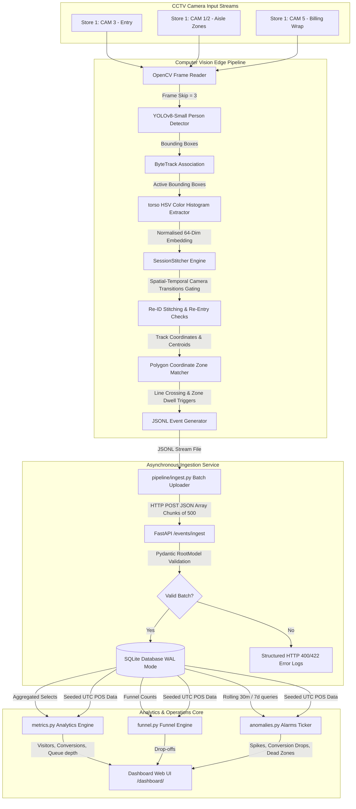

# System Architecture Design — Store Intelligence API

This document provides a production-grade technical design review of the Apex Retail Store Intelligence System. It details our architectural flow, computer vision tracking logic, database structures, and dynamic analytics handlers.

---

## 1. Comprehensive System Architecture

The application is structured into two primary operational layers:
1. **CV Edge Tracking Pipeline**: Processes raw video clips, handles spatial coordinate mapping, runs visual Re-ID, and outputs structured, schema-compliant JSON state events.
2. **REST API Service & Analytics Engine**: Ingests incoming event batches, enforces write idempotency, executes time-correlated POS conversion mapping, and evaluates operational warnings.

---

## 2. Component System Breakdown

### 2.1 Computer Vision Edge Processing
* **Object Detection**: Evaluates frame bounding boxes targeting the `person` class. Skips 2 of every 3 frames for high CPU frame-rate throughput.
* **Tracking (ByteTrack)**: Retains tracking states for occluded shoppers by preserving low-confidence boxes (down to $0.1$) that map to predicted Kalman filter trajectories.
* **Torso Re-ID & Spatial Gating**: Extracts a 64-dimensional normalized HSV color histogram of the torso (middle third of the bounding box). It matches tracks against active sessions seen within the last 5 minutes. Matches are gated by camera transition rules (e.g. preventing direct Re-ID matches between entry cameras and billing counters without intermediate aisle zone appearances), reducing false positive ID switches.
* **Event Generation**: Emits semantic events on state boundary crossings:
  * `ENTRY` / `EXIT`: Crossing the entry threshold line.
  * `ZONE_ENTER` / `ZONE_EXIT`: Traversing polygon boundaries.
  * `ZONE_DWELL`: Triggered every 30 seconds of continuous zone stay.
  * `BILLING_QUEUE_JOIN`: Triggered when entering the checkout zone when queue depth $> 0$.
  * `BILLING_QUEUE_ABANDON`: Computed post-processing by validating if billing exit was followed by a purchase within 5 minutes.

### 2.2 Ingestion & Database Cache (SQLite WAL)
* FastAPI intercepts incoming payloads via a Pydantic `RootModel` array validation scheme.
* Database operations run on SQLite in **WAL (Write-Ahead Logging) Mode** with `PRAGMA synchronous = NORMAL`. This decouples read and write threads, allowing concurrent query executions during bulk batch inserts.

### 2.3 Timezone Naive-UTC Data Alignment
To prevent temporal mismatches, the system standardizes all timestamps on naive UTC datetimes:
1. **POS transactions CSV**: `import_pos.py` parses transactions (local IST/UTC+5:30), shifts them by subtracting 5 hours and 30 minutes, and saves them as naive UTC objects.
2. **CCTV clips timeline**: `detect.py` maps the video start to 06:45:00 UTC (12:15:00 IST), ensuring video events line up with corresponding transaction timestamps.

### 2.4 Production Safety & Graceful Failure Handlers
* **Division-by-Zero Safety**: Metric and funnel queries intercept zero-visitor scenarios, returning `0.0` rather than raising divide-by-zero exceptions.
* **Database Down Circuit Breaker**: If SQLite files become locked or database access is lost, a FastAPI exception handler catches connection errors and immediately returns a clean JSON error schema with HTTP `503 Service Unavailable`, preventing raw traceback leakages.
