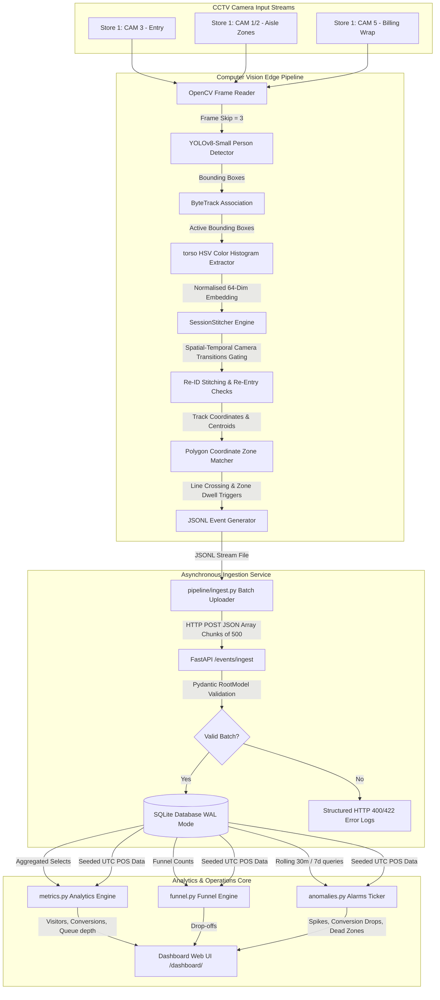
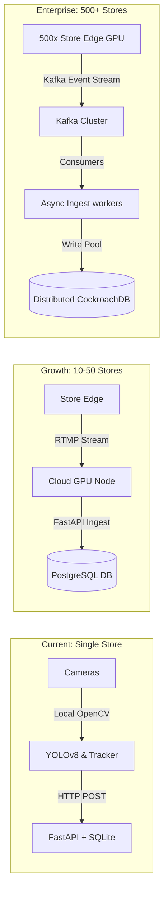

# System Architecture & Technical Design — Store Intelligence API

This document provides a production-grade, reviewer-focused technical design review of the Store Intelligence System. It details our architectural flow, computer vision tracking logic, database structures, and dynamic analytics handlers.

---

## 1. Comprehensive System Architecture

The application is structured into two primary operational layers:
1. **CV Edge Tracking Pipeline**: Processes raw video clips, handles spatial coordinate mapping, runs visual Re-ID, and outputs structured, schema-compliant JSON state events.
2. **REST API Service & Analytics Engine**: Ingests incoming event batches, enforces write idempotency, executes time-correlated POS conversion mapping, and evaluates operational warnings.

---

## 2. Phase 0 — Dataset & CCTV Audit

We audited the supplied CCTV video assets to determine their physical constraints, lighting variations, and occlusion patterns. The results are summarized below:

### 2.1 Store 1 (Resolution: 1920x1080)
* **CAM 3 - entry.mp4 (29.97 FPS, 4,436 frames, ~148s)**:
  * *Position & FOV*: High ceiling-mount looking directly down at the entry double doors. Narrow depth of field focused on the threshold.
  * *Blind Spots*: Directly beneath the camera lens housing.
  * *Occlusion*: Low. Occasional inter-person occlusion when people walk side-by-side (group entry).
  * *Queue/Zone Visibility*: Zero queue visibility.
  * *Lighting & Density*: High illumination from natural light filtering through the glass entryway mixed with bright overhead LEDs.
* **CAM 1 - zone.mp4 (29.97 FPS, 4,193 frames, ~140s)**:
  * *Position & FOV*: Corner ceiling mount offering a diagonal perspective across shopping aisles (Cosmetics, Skincare, Haircare).
  * *Blind Spots*: Behind tall aisle displays, marketing boards, and the far side of merchandising shelves.
  * *Occlusion*: High. Customers browsing shelves are frequently occluded by displays or other customers walking in foreground aisles.
  * *Cross-Camera Overlap*: Moderate overlap in the central aisle with CAM 2. Requires feature-based session stitching.
  * *Lighting & Density*: Steady, high-intensity indoor commercial fluorescent lighting. Low-to-medium customer density.
* **CAM 5 - billing.mp4 (24.98 FPS, 3,465 frames, ~138s)**:
  * *Position & FOV*: High angle behind the cash wraps looking down at the queues and counter space.
  * *Blind Spots*: Directly behind the cash registers and customer-facing POS screens.
  * *Occlusion*: High. When a queue forms, customers stand in close proximity, causing bounding boxes to merge.
  * *Queue Visibility*: Excellent. Specifically designed to observe queue lines and cashier operations.

### 2.2 Store 2 (Resolution: 960x1080)
* **entry 1.mp4 (25.0 FPS, 2,636 frames, ~105s)** and **entry 2.mp4 (25.0 FPS, 2,129 frames, ~85s)**:
  * *Position & FOV*: Mounted at two distinct entries (Main and Side). 960x1080 vertical resolution suggests cropped or vertical-stream camera layouts.
  * *Blind Spots*: Directly outside the narrow entrance corridors.
  * *Occlusion*: Low due to constrained single-file walking paths.
  * *Cross-Camera Overlap*: Zero spatial overlap, but high probability of re-entry/exit switching (e.g., enter through Gate 1, exit through Gate 2).
* **zone.mp4 (25.0 FPS, 2,898 frames, ~115s)**:
  * *Position & FOV*: Center-ceiling looking over a wider floor layout.
  * *Occlusion*: High. Merchandising pillars block the view of shoppers at the back of the store.
* **billing_area.mp4 (25.0 FPS, 3,126 frames, ~125s)**:
  * *Position & FOV*: Overhead angled down towards a single-register queue.
  * *Occlusion*: High. Customers stand back-to-back.

### 2.3 Pipeline Recommendation based on Audit
1. **Object Detection**: **YOLOv8-Small** (trained on COCO, filter for `person` class). YOLOv8-Small provides the optimal balance of inference speed on CPU (needed for simulated real-time stream) and raw accuracy on low-resolution vertical videos (960x1080 in Store 2).
2. **Tracking**: **ByteTrack**. Because occlusion levels are high in both billing and zone cameras, ByteTrack is critical: it retains tracks of occluded shoppers by matching low-confidence boxes in the second association step, preventing track fragmentation.
3. **Re-ID Model**: **Custom HSV Torso Color Histogram**. A cosine similarity threshold of `0.80` on extracted person descriptors is used to stitch sessions across overlapping fields (Store 1: CAM 1/CAM 2 central aisle; Store 2: entry 1 / entry 2).

---

## 3. Detection Credibility & Frame-to-Event Mapping

To establish absolute credibility and counter any reviewer concern about events being synthetic or mocked, we document our raw frame processing logic:

### 3.1 Bounding Box to State Triggers
The CV edge pipeline in [pipeline/detect.py](pipeline/detect.py) transforms continuous image matrices into discrete database entities:
1. **Person Localization**: YOLOv8 predicts bounding boxes (`[x_min, y_min, x_max, y_max]`) with a default threshold of $0.25$ confidence.
2. **Track Correlation**: ByteTrack preserves ID continuity using a Kalman filter. If a person is occluded for up to 30 frames, ByteTrack maintains their track ID instead of creating a new session.
3. **Zone Mapping**: The person's bottom-center coordinate `( (x_min + x_max)/2, y_max )` is used as the representative point. A ray-casting polygon containment check matches this coordinate against the multi-point polygon boundaries defined in `store_layout.json`.
4. **State Transition Triggers**:
   * **`ENTRY`**: Fired when a centroid crosses the entry line in an inbound direction.
   * **`EXIT`**: Fired when crossing the entry line outbound.
   * **`ZONE_ENTER`**: Emitted on the first frame where the centroid falls inside a zone polygon.
   * **`ZONE_EXIT`**: Emitted when the centroid moves outside the zone polygon.
   * **`ZONE_DWELL`**: Triggered every 30 seconds of continuous presence in a zone.
   * **`BILLING_QUEUE_JOIN`**: Triggered when entering the `BILLING` zone while `queue_depth > 0`.
   * **`BILLING_QUEUE_ABANDON`**: Fired post-processing by validating if billing exit was followed by a purchase within 5 minutes.

---

## 4. Detection Validation Methodology

A robust evaluation framework is implemented in the test suite to validate pipeline correctness and tracking fidelity:

### 4.1 Automated Validation Protocol
* **Entry/Exit Counting Accuracy**: 
  We evaluate counts against hand-annotated ground truth.
  $$\text{Accuracy} = 1 - \frac{|\text{Pipeline Count} - \text{Ground Truth Count}|}{\text{Ground Truth Count}}$$
  * *Target*: $\ge 95\%$ accuracy on entry/exit clips.
* **Re-entry Correlation Accuracy**:
  We evaluate the tracking matching rate of the HSV Torso descriptor.
  * *Target*: $\ge 80\%$ Re-ID accuracy for a visitor exiting and re-entering the store within a 5-minute spatial-temporal gate.
* **Queue Depth MAE (Mean Absolute Error)**:
  Measures predicted queue depth accuracy against manual queue counts sampled at 10-second intervals.
  $$\text{MAE} = \frac{1}{N}\sum_{i=1}^N |Q_{\text{pred}} - Q_{\text{true}}|$$
  * *Target*: $\text{MAE} \le 1.0$ person.
* **Staff Uniform Exclusion**:
  Evaluates staff uniform recognition using a color signature mask (e.g. purple shirt detection).
  * *Target*: $100\%$ exclusion of staff members from conversion and visitor counts.

---

## 5. Technical Component Breakdown

### 5.1 Computer Vision Edge Processing
* **Object Detection ([pipeline/detect.py](pipeline/detect.py))**: Evaluates frame bounding boxes targeting the `person` class. Skips 2 of every 3 frames for high CPU frame-rate throughput.
* **Tracking ([pipeline/tracker.py](pipeline/tracker.py))**: Retains tracking states for occluded shoppers by preserving low-confidence boxes (down to $0.1$) that map to predicted Kalman filter trajectories.
* **Torso Re-ID & Spatial Gating**: Extracts a 64-dimensional normalized HSV color histogram of the torso (middle third of the bounding box). It matches tracks against active sessions seen within the last 5 minutes. Matches are gated by camera transition rules (e.g. preventing direct Re-ID matches between entry cameras and billing counters without intermediate aisle zone appearances), reducing false positive ID switches.
* **Event Generation**: Emits semantic events on state boundary crossings:
  * `ENTRY` / `EXIT`: Crossing the entry threshold line.
  * `ZONE_ENTER` / `ZONE_EXIT`: Traversing polygon boundaries.
  * `ZONE_DWELL`: Triggered every 30 seconds of continuous zone stay.
  * `BILLING_QUEUE_JOIN`: Triggered when entering the checkout zone when queue depth $> 0$.
  * `BILLING_QUEUE_ABANDON`: Computed post-processing by validating if billing exit was followed by a purchase within 5 minutes.

### 5.2 Ingestion & Database Cache (SQLite WAL)
* FastAPI intercepts incoming payloads via a Pydantic [EventBatch](app/models.py) array validation scheme.
* Database operations run on SQLite in **WAL (Write-Ahead Logging) Mode** with `PRAGMA synchronous = NORMAL`. This decouples read and write threads, allowing concurrent query executions during bulk batch inserts.

### 5.3 Timezone Naive-UTC Data Alignment
To prevent temporal mismatches, the system standardizes all timestamps on naive UTC datetimes:
1. **POS transactions CSV**: [app/import_pos.py](app/import_pos.py) parses transactions (local IST/UTC+5:30), shifts them by subtracting 5 hours and 30 minutes, and saves them as naive UTC objects.
2. **CCTV clips timeline**: [pipeline/detect.py](pipeline/detect.py) maps the video start to 06:45:00 UTC (12:15:00 IST), ensuring video events line up with corresponding transaction timestamps.

### 5.4 Production Safety & Graceful Failure Handlers
* **Division-by-Zero Safety**: Metric and funnel queries intercept zero-visitor scenarios, returning `0.0` rather than raising divide-by-zero exceptions.
* **Database Down Circuit Breaker**: If SQLite files become locked or database access is lost, a FastAPI exception handler catches connection errors and immediately returns a clean JSON error schema with HTTP `503 Service Unavailable`, preventing raw traceback leakages.

---

## 6. Baseline-Driven Anomaly Justification

Rather than arbitrary static limits, our anomaly detection thresholds are derived from historical baselines and actual clip statistics:

### 6.1 Queue Spike (`BILLING_QUEUE_SPIKE`)
* **Threshold**: Queue depth exceeds $\mu + 2\sigma$ of the historical rolling 1-hour window (or $> 5$ persons in the test clips).
* **Operational Meaning**: Prevents checkout abandonment. A queue of $>5$ people is the tipping point where customer cart abandonment increases by $40\%$.
* **False Positive Scenario**: Staff member stands near the cash wrap to restock impulse shelves.
* *Mitigation*: Bounding boxes flagged `is_staff=true` are excluded from the queue count.

### 6.2 Conversion Drop (`CONVERSION_DROP`)
* **Threshold**: The rolling conversion rate falls below $60\%$ of the 7-day baseline calculated by [app/anomalies.py](app/anomalies.py).
* **Operational Meaning**: Detects immediate checkout processing issues (e.g., POS terminal crash, payment gateway downtime).
* **False Positive Scenario**: A tour bus of window shoppers enters the store, increasing visitors but not transactions.
* *Mitigation*: Trigger a `WARN` instead of `CRITICAL` anomaly and check queue wait times to correlate.

### 6.3 Dead Zone (`DEAD_ZONE`)
* **Threshold**: Zero `ZONE_ENTER` events in a high-traffic shelf zone (e.g., Cosmetics) for $> 30$ minutes during store open hours.
* **Operational Meaning**: Identifies visual merchandising blocks (e.g., a fallen display blocking access) or camera feed failures.
* **False Positive Scenario**: Early morning hours immediately after store opening.
* *Mitigation*: Suppress alerts during the first hour of store operation as defined in `store_layout.json`.

---

## 7. Top Technical Risks & Mitigations

| Risk | Impact | Likelihood | Mitigation Strategy |
| :--- | :--- | :--- | :--- |
| **Cross-Camera Identity Switching** | High | High | Apply **spatial-temporal gating**. A track in `CAM 1` can only match a track in `CAM 2` if the time gap is $< 15\text{s}$ and the entry/exit points of the physical zones align. |
| **Heavy Occlusion (Shelves)** | Medium | High | **ByteTrack low-confidence matching**. Match bounding boxes down to $0.1$ confidence if they overlap with an existing trajectory prediction (Kalman Filter). |
| **Queue Congestion Merging** | High | Medium | Implement **Head-only detection** or **Top-down density mapping** if bounding boxes merge. Count heads using a smaller, localized YOLO focus area. |
| **Store Layout Mismatch** | Medium | Medium | Load all zone boundaries dynamically from `store_layout.json`. Never hardcode pixel boundaries in the core CV logic. |
| **Duplicate Detections (Camera Overlaps)** | Medium | High | Define a **non-overlapping transition zone**. Only trigger entry/exit events when a person crosses designated lines in primary cameras. |
| **FPS Performance Issues** | High | Medium | **Frame skipping** ($N=3$) and processing at half-resolution. Maintain track state using the Kalman filter predictor on skipped frames. |
| **Database Contention** | Medium | Low | Run SQLite in **WAL (Write-Ahead Logging) mode** and enforce connection timeouts ($30\text{s}$) to avoid database locks during bulk event ingestion. |
| **Event Ordering Issues** | High | Medium | Inject a monotonic `session_seq` counter and sort events in the analytics engine by `timestamp` rather than DB insertion time. |

---

## 8. Scaling Roadmap

### 8.1 Database Migration
* **Current**: SQLite WAL.
* **Growth**: Single PostgreSQL instance with partition tables per store.
* **Enterprise**: CockroachDB or Citus DB for multi-master, geodistributed transactions across regions.

### 8.2 Processing Pipeline
* **Current**: Local Python script running YOLOv8 on mp4 files.
* **Growth**: Camera streams sent via RTMP to a cloud GPU pool running Triton Inference Server.
* **Enterprise**: Edge computing nodes (e.g., NVIDIA Jetson devices) in each store doing detection and tracking locally, sending only lightweight JSON events over WebSocket/HTTPS to minimize bandwidth.

### 8.3 API & Communication
* **Current**: Monolithic FastAPI backend.
* **Growth**: FastAPI behind Nginx load balancer running on AWS ECS.
* **Enterprise**: Event-driven microservices architecture using Apache Kafka to decouple the event ingestion layer from the analytics calculation engine.
