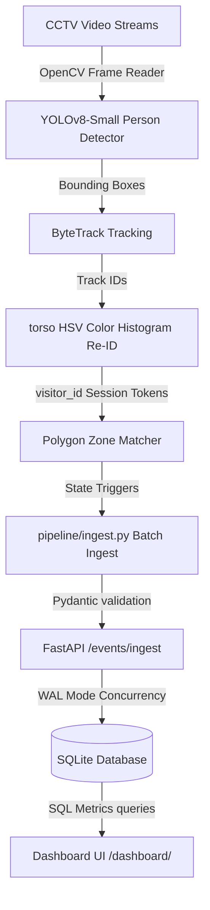

# Apex Store Intelligence Platform — Purplle Tech Challenge

Apex Retail Store Intelligence System is an end-to-end computer vision and analytics platform that transforms raw CCTV video streams into live dashboard metrics, conversion funnels, and operational anomalies.

---

## 1. Visual Pipeline Architecture

The flow of information from raw video frame ingestion to API metrics delivery:



For a detailed breakdown of components, see [DESIGN.md](DESIGN.md) and [CHOICES.md](CHOICES.md).

---

## 2. Quick Setup (Docker Compose)

To build, seed, and launch the REST API and live dashboard on a clean machine:

```bash
# 1. Start the API and test containers via Docker Compose
docker compose up -d

# 2. Run the test suite to verify statement coverage and correctness
docker compose run --rm test

# 3. Seed the SQLite database with POS transaction records (IST converted to UTC)
docker compose exec api python app/import_pos.py

# 4. Run the computer vision tracking pipeline on Store 1 & Store 2 clips
docker compose exec api bash pipeline/run.sh

# 5. Ingest the generated events into the REST API database using our helper script
docker compose exec api python pipeline/ingest.py pipeline_events.jsonl http://localhost:8000/events/ingest
```

Once running:
* **Interactive Dashboard**: Navigate to [http://localhost:8000/dashboard/](http://localhost:8000/dashboard/)
* **Interactive API Reference**: Access Swagger docs at [http://localhost:8000/docs](http://localhost:8000/docs)

---

## 3. Local Development (Without Docker)

If you have python installed locally, you can run components directly:

### 3.1 Install Dependencies
```bash
pip install -r requirements.txt
```

### 3.2 Seed Transactions & Process Videos
```bash
# Seed POS transactions
python app/import_pos.py

# Run tracking pipeline on all clips (Windows PowerShell)
powershell -ExecutionPolicy Bypass -File pipeline/run.ps1
```

### 3.3 Ingest Events
```bash
# Run the local python batch importer
python pipeline/ingest.py pipeline_events.jsonl http://localhost:8000/events/ingest
```

### 3.4 Start Local Development API
```bash
uvicorn app.main:app --reload --host 127.0.0.1 --port 8000
```

---

## 4. System Endpoints

The API is defined in [app/main.py](app/main.py) and schema models in [app/models.py](app/models.py):

| Method | Endpoint | Description |
| :--- | :--- | :--- |
| `POST` | `/events/ingest` | Ingests a batch of up to 500 events (idempotent, returns 202) |
| `GET` | `/stores/{id}/metrics` | Returns unique visitors, conversion rate, queue depth |
| `GET` | `/stores/{id}/funnel` | Returns conversion funnel progression stages |
| `GET` | `/stores/{id}/heatmap` | Returns normalized shopping zone heatmap values |
| `GET` | `/stores/{id}/anomalies` | Lists active warnings (queue spikes, dead zones) |
| `GET` | `/health` | Verifies DB connection and reports feed status |
